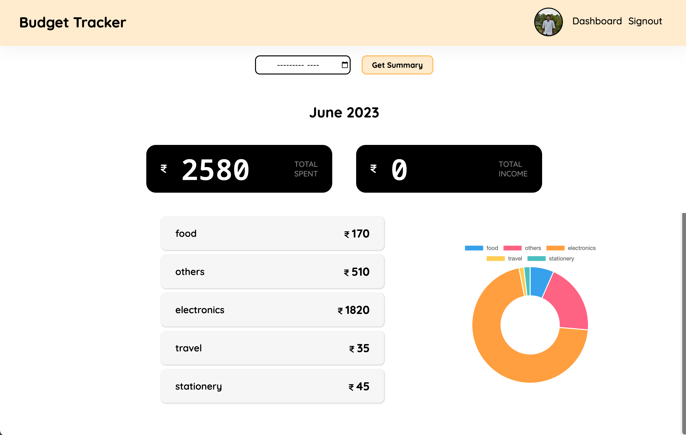
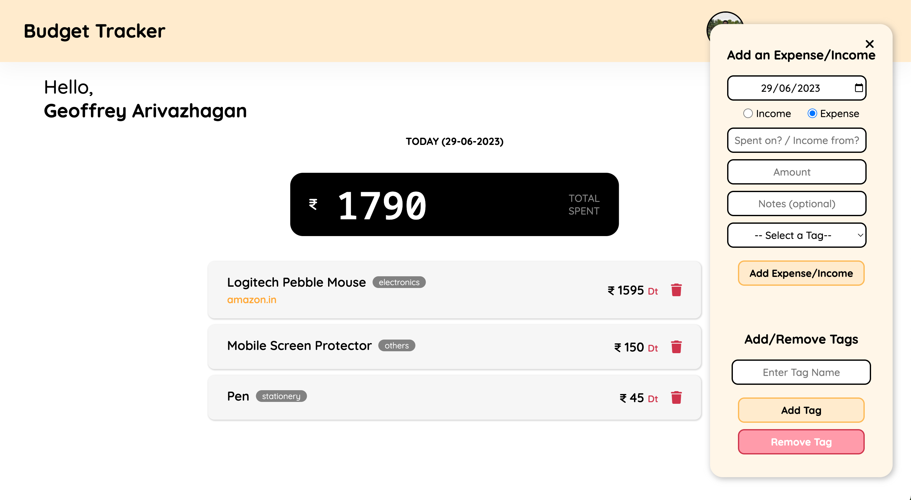

Full Stack Expense Tracker App.

## Table of contents

- [Links](#links)
- [Overview](#overview)
- [Screenshot](#screenshot)
- [Built with](#built-with)
- [To run the app on Local Server](#to-run-the-app-on-local-server)
- [Folder Structure](#folder-structure)
- [Author](#author)

### Links

- Live Site URL: [Live Site URL here](https://expense-tracker-bfat.onrender.com/)

### Overview

- This is a Full Stack Expense Tracker Application. You can log all the daily expenses. And view the statistics of the where have you spend the money for every month.

### Screenshot

### Built with

- NodeJS
- Express
- EJS
- MongoDB
- Mongoose
- SCSS/SASS

### To run the app on Local Server

- Must have NodeJs and MongoDB installed.
- Install all needed npm dependencies from package.json.
- Get client id and client secret for implementing Google authentication store those in the environment variables.
- "npm start" (or) "npm run dev" if you need to compile sass files.
- Server should run on "http://localhost:8000/".

## Folder Structure

expense-tracker  
├───assets  
│ ├───css  
│ ├───images  
│ ├───js  
│ └───scss  
├───config  
├───controllers  
├───models  
├───routes  
└───views  

## Author

Geoffrey
